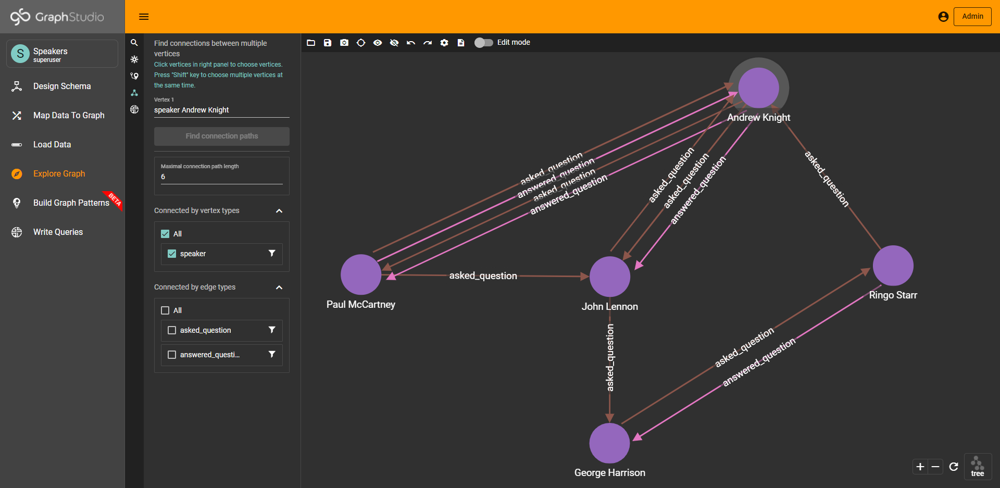
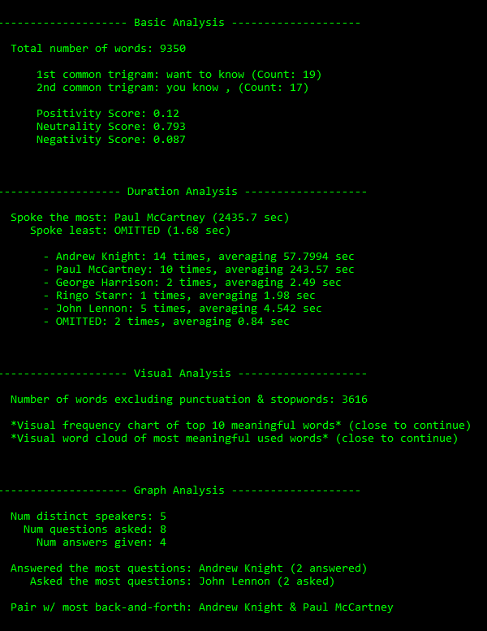
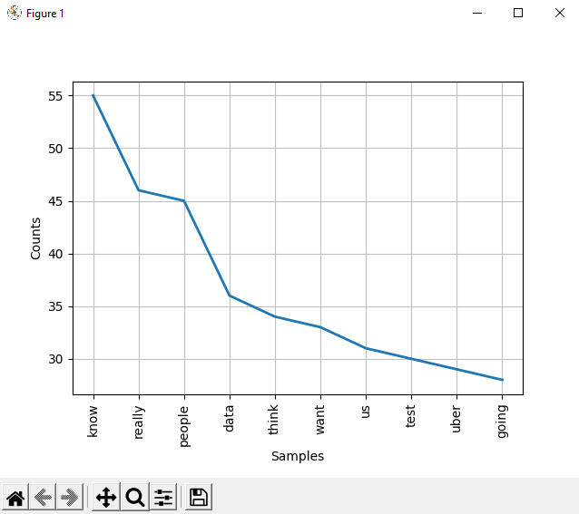
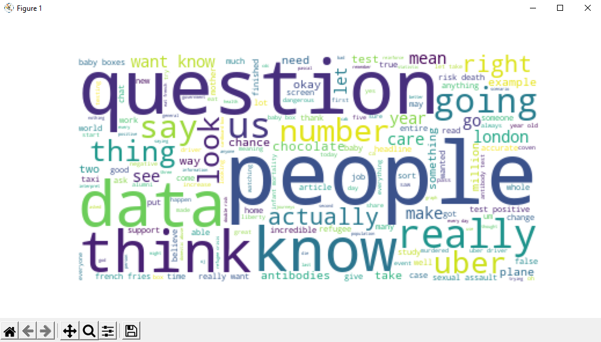

# Transcript Analysis - Graph + NLP

This program extracts insights from Zoom Meeting Transcripts (`.vtt`) using TigerGraph and NLTK.

In order to run this program, modify the `auth.ini` file with your proper graph solution credentials
and file paths. Then, simply run `main.py`. A sample transcript has been provided, but feel free to add your own into the `\a_raw_transcripts` directory!

Kindly find an overview and demo video [hyperlinked here](https://www.youtube.com/watch?v=8v3k_1K4B_Y)

&nbsp; &nbsp;

As of now, this program performs the following tasks:

1. Convert `.vtt` into compact version (stored in `\b_cmt_transcripts`)

2. NLP analysis of compact transcript (using NLTK)
   - Sentiment analysis
   - Trigrams (collocations)
   - Frequency of words (plotted)
   - Meaningful words (shown as wordcloud)
   - Number of speakers, names of speakers
   - Who spoke the longest, least, average

 3. Graph analysis of compact transcript (using TigerGraph)
     - Analyze relationships between speakers
     - Asked the most/least questions
     - Pair w/ the most back-and-forth
     - (TODO): Linking topics in semantic graph
     - (TODO): Named-Entity Recognition

 4. Visual output of all determined insights

&nbsp; &nbsp;

## Usage

A TigerGraph Cloud Portal solution (https://tgcloud.io/) will be required to run this program.

Kindly find the GraphStudio link here: https://transcript-analysis.i.tgcloud.io/

&nbsp; &nbsp;

The schema utilized in this graph is fleshed out below:

Vertex: speaker
- (PRIMARY ID) name - STRING

Edge: asked_question
- text - STRING

Edge: answered_question

&nbsp; &nbsp;

Here is an example of the graph populated with the sample transcript provided:

&nbsp; &nbsp;

## Analysis

Here is a screenshot of the command-line output produced:

Here is a frequency chart of meaningful words generated:

Here is a word cloud that visualizes common, key terms:  

More features coming soon! In the meantime, feel free to continue creating and adding new insights 😁😁

&nbsp; &nbsp;

## References

* [Zoom Transcript Compacter](https://github.com/lethain/vtt_compactor)
* [TigerGraph documentation](https://docs.tigergraph.com/)
